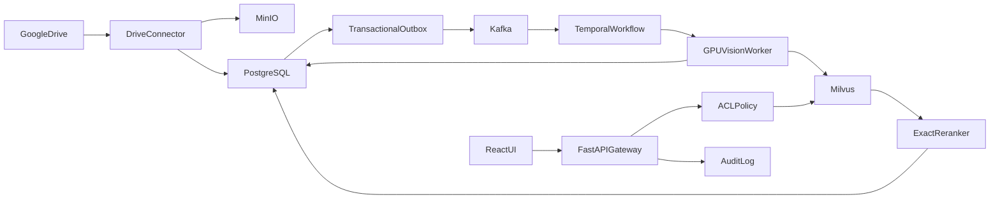

# Phase 1 Enterprise Face Search Foundation

## Scope and architecture decisions
- Build a new monorepo because the workspace currently contains only [the architecture review](docs/ENTERPRISE_FACE_SEARCH_ARCHITECTURE_REVIEW.md).
- Standardize on **Milvus** for face vectors; PostgreSQL remains the source of truth, MinIO stores originals/crops, Temporal controls idempotent workflows, and Kafka carries durable integration/domain events through a transactional outbox.
- Deliver Google Drive ingestion, RetinaFace detection, InsightFace five-point alignment, ArcFace 512D embeddings, FIQA, filtered ANN, exact quality-aware reranking, audit, and deletion.
- Explicitly defer person clustering, deduplication, CLIP/OCR, graph retrieval, active learning, and Phase 2 billion-vector tuning.
- Treat commercial InsightFace model rights and biometric policy approval as release gates; configuration must require explicitly supplied, checksummed model artifacts rather than silently downloading research-only weights.

## 1. Bootstrap the monorepo and local platform
- Create Python packages under `services/` for `ingest-api`, `drive-connector`, `vision-worker`, `search-api`, `policy-service`, and `index-controller`; share Pydantic/event contracts in `packages/schemas` and evaluation code in `packages/eval`.
- Create a React/TypeScript application in `web/` with authentication shell, query upload, filtered result grid, and audit/deletion views.
- Add `deploy/compose/` for a reproducible developer stack: PostgreSQL, MinIO, Milvus and its dependencies, Temporal, Kafka, and observability; reserve Kubernetes/Helm production manifests for the deployment workstream.
- Establish pinned dependencies, environment validation, structured logging, OpenTelemetry instrumentation, health/readiness endpoints, formatting, linting, unit tests, and CI entry points.

## 2. Define authoritative schemas, events, and lifecycle invariants
- Add Alembic migrations for `tenants`, `repositories`, `assets`, `asset_acl`, `faces`, `model_versions`, `index_generations`, `index_mutations`, `deletion_journal`, `connector_cursors`, `workflow_runs`, and append-only `audit_events`.
- Use immutable UUIDs for assets/faces, content checksums for idempotency, and uniqueness constraints on `(tenant_id, repository_id, external_id, external_version)`.
- Define versioned Pydantic/JSON event envelopes for asset discovered/changed/deleted, vision completed/failed, index upsert/delete, and ACL changed.
- Implement the transactional outbox and consumers with deduplication keys; state transitions must be monotonic and replay-safe.
- Create Milvus collection schemas keyed by `face_id`, with 512D cosine vectors and scalar fields for tenant, repository, asset, model/preprocess generation, quality band, and deletion state; never query without tenant and ACL-derived filters.

## 3. Implement Google Drive ingestion and durable processing
- Implement OAuth/service-account credential adapters, Shared Drive traversal, change-token polling, retry/backoff, MIME allowlists, ACL/permission projection, and cursor persistence in `services/drive-connector`.
- Stream source objects to MinIO while calculating SHA-256; reject decompression bombs and unsupported/corrupt media in a sandboxed decoder path.
- Commit asset metadata and outbox events atomically, then start a Temporal workflow whose activities are individually retryable and idempotent.
- Handle updates as new external versions and deletes as immediate authorization revocation plus deletion-journal entries.

## 4. Build the versioned vision and quality pipeline
- Load explicitly configured RetinaFace and ArcFace ONNX artifacts from the model registry; verify license metadata and checksums at worker startup.
- Implement EXIF orientation, bounded image decode, resolution buckets, optional tiled detection, five-point `norm_crop`, ArcFace batching, L2 normalization, and coordinate conversion back to the original image.
- Add a FIQA adapter initially backed by validated SER-FIQ or CR-FIQA inference, plus deterministic component signals: detector confidence, face pixels, pose, blur, occlusion/alignment residual.
- Persist face geometry, quality evidence, preprocessing/model versions, and the exact rerank vector; only publish Milvus upserts after PostgreSQL commits succeed.
- Add golden-image parity tests for RGB/BGR, alignment, ONNX output, L2 norm, batching, FP32/FP16 tolerance, tiny faces, corrupt images, and no-face images.

## 5. Implement policy-safe search and exact reranking
- Add `POST /v1/face-search` accepting a single query face image, tenant/repository/date filters, requested result count, and purpose code; reject ambiguous multi-face queries unless the caller selects a detected face.
- Run the same versioned query pipeline, derive authorized repository/asset constraints in the policy service, and push tenant/model/ACL constraints into Milvus before candidate generation.
- Retrieve a configurable shortlist, then fetch stored FP16/FP32 vectors and compute exact cosine similarity; apply a documented quality-aware scoring function and return calibrated risk bands rather than claiming raw cosine is probability.
- Group face hits into unique asset results, include bounding boxes and score/quality evidence, exclude tombstones again after reranking, and paginate with stable opaque cursors.
- Implement React query upload, face selection, filters, result thumbnails, evidence details, and permission-denied/no-face states.

## 6. Implement deletion, audit, operations, and acceptance tests
- On deletion or ACL revocation: deny access in PostgreSQL first, append a deletion journal entry, remove/tombstone Milvus points, invalidate caches, and asynchronously purge MinIO objects/crops according to retention/legal-hold policy.
- Implement reconciliation jobs comparing PostgreSQL face state with Milvus points, plus replay tools for outbox events and deletion journals; restores must replay deletions before readiness succeeds.
- Audit searches, result access, exports, ACL decisions, model/index versions, administrative deletion, and failures without persisting raw query images beyond policy.
- Add dashboards/alerts for ingestion lag, workflow retries, detection yield by face-size bucket, GPU queues, Milvus latency/recall sample, ACL denials, deletion SLA, and audit failures.
- Add end-to-end acceptance suites for duplicate delivery, connector restart, model-version separation, unauthorized cross-tenant search, ACL revocation during a query, deletion and restore, malformed images, partial dependency failure, and exact-rerank correctness.
- Gate release on: no cross-tenant/ACL leakage; soft suppression within 60 seconds; 5–15 minute freshness under target Phase 1 load; measured TAR/FAR and subgroup/domain report; ANN recall measured against exact search; and documented model-license/privacy approval.