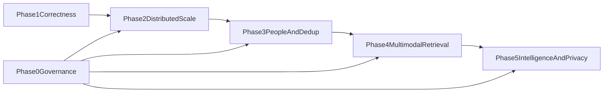

# Remaining Enterprise Face Search Roadmap: Phases 2–5

## Scope and dependencies

- Start only after `.cursor/plans/phase_one_face_search_5a2937f3.plan.md` passes its correctness, ACL, deletion, licensing, and accuracy gates.
- Keep RetinaFace, five-point alignment, and ArcFace 512D as the biometric core.
- Keep PostgreSQL authoritative, Milvus for face vectors, MinIO/Ceph-compatible storage, Temporal workflows, Kafka events, FastAPI APIs, and React UI.
- Apply Phase 0 purpose, jurisdiction, consent, retention, legal-hold, audit, and model-BOM controls to every new module.
- Gate every phase independently; code completion does not authorize production rollout.

---

# Phase 2: Distributed Scale and Reliability

## Objective

Scale to 100M images and approximately 1B face vectors while retaining p95 search below two seconds, 5–15 minute freshness, 99.9% search availability, and deletion suppression within 60 seconds.

## 2.1 Capacity and performance baseline

- Build a privacy-approved benchmark corpus reflecting image resolution, faces per image, tiny-face frequency, ACL selectivity, tenant skew, and update/delete rates.
- Add load generators for ingest, search, ACL churn, deletion, backfill, and mixed live/backfill traffic.
- Measure detector images/sec, ArcFace faces/sec, GPU batch fill, Milvus recall/latency, exact-rerank I/O, cache hits, and storage request rates.
- Publish capacity formulas and initial production sizing for GPUs, Milvus nodes, PostgreSQL, Kafka, Temporal, NVMe, memory, network, and object storage.

## 2.2 Distributed Milvus and index generations

- Partition using tenant/repository routing keys; dedicate shards to very large tenants and bucket small tenants without cross-tenant queries.
- Benchmark HNSW, IVF-PQ, and disk-oriented indexes against exact FAISS ground truth for recall@K, selective filters, memory, build cost, and tail latency.
- Maintain a mutable delta for fresh vectors and sealed immutable generations for the bulk corpus.
- Store FP16 or FP32 exact vectors on local NVMe/object-store packed segments for top-M reranking.
- Implement dual-write, checkpointed backfill, reconciliation manifests, shadow queries, atomic index aliases, rollback, tombstones, and physical compaction.
- Bound query fanout using tenant maps and coarse routing; never routinely broadcast to every shard.

## 2.3 GPU, object storage, and caching

- Split RetinaFace, ArcFace, and future enrichment workers into independent pools with resolution buckets and dynamic batching.
- Validate ONNX Runtime/TensorRT FP16 output against canonical FP32 golden vectors before enabling acceleration.
- Pack face crops into immutable shard containers rather than creating 1B tiny objects; maintain face-to-byte-range manifests.
- Add an ACL-aware result cache keyed by query fingerprint, model generation, policy hash, filters, and tenant; invalidate on ACL/delete generation changes.
- Isolate live ingest, search, rebuild, and backfill quotas so maintenance cannot starve production.

## 2.4 Production deployment and resilience

- Add Kubernetes/Helm manifests, pod disruption budgets, topology spread, autoscaling, network policies, signed-image admission, Vault integration, and GPU scheduling.
- Deploy Milvus replicas across failure domains and document consistency/acknowledgment semantics.
- Implement regional backup, restore, deletion-journal replay, index reconciliation, RPO/RTO, and failback runbooks.
- Add chaos tests for Milvus node loss, PostgreSQL failover, Kafka lag, object-store latency, GPU failure, and retry storms.

## Phase 2 acceptance gate

- ANN recall@K meets the approved target against exact search under representative ACL filters.
- p95 end-to-end search is below 2 seconds and p99 below 4 seconds at target concurrency.
- Search remains available through one shard/node failure without ACL or deletion leakage.
- Freshness and deletion SLAs pass during simultaneous live ingest and backfill.
- Seven-day soak and restore drill pass; capacity plan includes 30% operational headroom.

---

# Phase 3: People, Clustering, and Duplicate Resolution

## Objective

Convert raw face hits into auditable person-centric discovery while preventing unsafe automatic identity merges and reducing duplicate-heavy results.

## 3.1 Person and evidence domain

- Add `persons`, `person_templates`, `face_assignments`, `clusters`, `cluster_members`, `identity_edges`, `review_tasks`, and `review_decisions`.
- Separate unnamed cluster hypotheses from named persons; naming requires policy permission and audited human action.
- Maintain quality-weighted person templates with provenance to contributing faces and model/index generation.
- Represent assignments as evidence with confidence, source, reviewer, timestamps, and reversible state rather than destructive labels.

## 3.2 Quality-gated incremental clustering

- Build tenant-scoped kNN graphs in ArcFace space using only eligible quality bands.
- Implement conservative HDBSCAN/DBSCAN or graph-connected clustering with cannot-link constraints and safeguards against bridge merges.
- Use temporal, repository, event, and co-occurrence features only as soft evidence; never override strong biometric contradictions.
- Re-cluster incrementally around new faces and changed edges rather than rebuilding every tenant globally.
- Add offline experiments for STAR-FC/Ada-NETS only after the baseline is measured; research code must not directly serve production.

## 3.3 Exact and near-duplicate planes

- Use SHA-256 and source version IDs for exact duplicate blobs.
- Add SSCD descriptors and a separate Milvus collection for transformed/edited copy detection.
- Create asset stacks with canonical-original selection, metadata merge rules, source provenance, and reversible resolution decisions.
- Collapse duplicate stacks in search results while retaining an expandable view of every authorized copy.
- Never merge identities solely because two ArcFace vectors or two images are close.

## 3.4 Human review and people UX

- Build React views for unnamed clusters, person albums, merge/split, incorrect match, duplicate stack, and evidence inspection.
- Prioritize low-margin cluster boundaries and high-impact merge candidates; record reviewer identity and rationale.
- Add four-eyes approval for large/high-risk merges and restricted tenants.
- Propagate corrections to templates, indexes, result caches, and audit streams without retraining ArcFace.

## Phase 3 acceptance gate

- BCubed and pairwise clustering scores meet approved thresholds on a labeled holdout.
- False person merges remain below the risk threshold; all merges/splits are reversible and audited.
- Reviewer throughput and median task time meet product targets.
- Duplicate-collapsed result precision improves without reducing person-level recall beyond tolerance.
- Person operations obey tenant, repository, purpose, jurisdiction, consent, deletion, and legal-hold rules.

---

# Phase 4: Multimodal, Temporal, and Explainable Retrieval

## Objective

Support face, text, OCR, visual-semantic, metadata, and temporal search through a policy-aware query planner while preserving the fast biometric path.

## 4.1 Enrichment pipelines

- Add versioned OpenCLIP or SigLIP image embeddings in a separate Milvus collection.
- Add OCR with normalized text, language, confidence, bounding polygons, and OpenSearch indexing.
- Normalize EXIF time/timezone, geolocation, repository path, labels, captions, and enterprise metadata with provenance.
- Apply the same ACL, jurisdiction, retention, deletion, and model-BOM controls to all enrichment artifacts.

## 4.2 Query planner and hybrid retrieval

- Add a typed query DSL for face image, text, people, date ranges, repository, location, OCR terms, and boolean filters.
- Plan independent face, visual, OCR/BM25, metadata, and temporal retrieval branches with per-branch deadlines.
- Fuse initial rankings using reciprocal rank fusion; keep raw branch scores and ranks for evaluation and explanations.
- Return the fast classic result set first; permit slower enrichment in a second response only when product UX supports it.

## 4.3 Temporal and graph context

- Group assets into event hypotheses using time gaps, source albums, location, and co-occurrence.
- Build a tenant-scoped graph linking people, assets, repositories, events, and duplicate stacks.
- Use graph/context features only for reranking and discovery; expose why context changed rank.
- Prevent graph traversal across unauthorized repositories even when a shared person/event connects them.

## 4.4 Explainability and multimodal UI

- Return detector box, face quality band, exact similarity band, matched person evidence, branch ranks, metadata/OCR matches, and policy exclusions.
- Distinguish biometric evidence from contextual evidence and label uncertain results.
- Build React natural-language/structured search, timelines, event views, highlighted OCR, and explanation panels.
- Audit query plans, branch execution, explanations shown, exports, and result opens.

## Phase 4 acceptance gate

- Text and multimodal nDCG/Recall@K meet targets on an enterprise query set.
- Hybrid retrieval provides statistically significant uplift over the best single branch.
- Face-only latency does not regress beyond its budget; hybrid p95 meets the approved tier.
- Explanations are faithful to stored scoring features and expose no unauthorized metadata.
- OCR/CLIP deletion and ACL propagation pass the same restore tests as biometric data.

---

# Phase 5: Learned Intelligence and Privacy R&D

## Objective

Use feedback to improve ranking and reviewer efficiency, evaluate difficult-face enhancements, and research stronger template privacy without replacing ArcFace or weakening governance.

## 5.1 Active learning and feedback

- Build an expected-recall-gain review policy combining uncertainty, cluster impact, diversity, tenant risk, and reviewer cost.
- Create train/validation/test splits by tenant and time to avoid feedback leakage.
- Store immutable feature snapshots and feedback provenance; never silently use customer feedback to retrain ArcFace.
- Compare active selection against random, uncertainty-only, and diversity-only baselines.

## 5.2 Learned reranking

- Train an interpretable LambdaMART/XGBoost ranker over exact ArcFace similarity, FIQA, face size, model generation, duplicate state, repository prior, OCR/CLIP ranks, and graph evidence.
- Enforce monotonic or policy constraints where practical and exclude protected attributes.
- Calibrate score bands per approved domain; add abstention for out-of-distribution queries.
- Deploy in shadow mode, then tenant canary, with rollback to deterministic RRF/quality-aware ranking.

## 5.3 Difficult and small-face research

- Establish a tiny-face benchmark by face-pixel bucket before adding super-resolution.
- Compare multiscale tiling, better decode/resampling, multi-frame/template aggregation, and optional identity-preserving SR.
- Never index hallucinated SR output without storing original evidence and a separate transform version.
- Ship only methods that improve TAR at fixed FAR across domains without material subgroup regression.

## 5.4 Privacy-preserving templates

- Prototype cancelable transforms, secure enclaves, and hybrid cancelable-biometrics plus homomorphic matching in an isolated research environment.
- Measure revocability, irreversibility, unlinkability, accuracy loss, latency, throughput, key compromise behavior, and billion-scale feasibility.
- Keep plaintext ArcFace production behavior unchanged until Privacy, Security, Model Risk, and performance gates approve a migration path.
- Treat patents/publications as a separate counsel-reviewed process; record prior art and avoid claiming generic face search, HNSW, or quality thresholds.

## 5.5 Research operations

- Create a model/experiment registry with dataset approval, code commit, MBOM, metrics, subgroup results, and reproducibility artifacts.
- Require offline evaluation, shadow deployment, canary, rollback, and signed model-risk approval for every learned component.
- Monitor drift, rank-feature distributions, calibration, reviewer bias, and feedback loops after release.

## Phase 5 acceptance gate

- Learned ranking and active review show reproducible uplift with confidence intervals and no security/policy regression.
- Shadow and canary deployments satisfy latency, calibration, subgroup, and rollback requirements.
- Small-face methods improve fixed-FAR metrics rather than visual appearance only.
- Privacy prototypes have a documented threat model and cannot enter production without separate approval.
- Research artifacts are reproducible, licensed, signed, and linked to experiment/model BOMs.

---

# Cross-phase validation and final handoff

## Security and governance

- Re-run DPIA, threat model, model-BOM, purpose, retention, legal-hold, and jurisdiction reviews for each new model and data type.
- Red-team cross-tenant ANN, graph, OCR, cache, person, duplicate, and export paths.
- Prove deletion suppression and physical purge across PostgreSQL, Milvus collections, OpenSearch, caches, graph stores, packed crops, backups, and restored clusters.

## Quality and operations

- Maintain golden datasets for detection, ArcFace parity, FIQA, clustering, duplicate detection, OCR, visual search, and hybrid ranking.
- Version every model, preprocessor, index, feature schema, calibration, and ranker.
- Publish SLOs, error budgets, capacity forecasts, incident runbooks, DR drills, and rollback procedures.

## Completion criteria

- Phase 2 scale, Phase 3 identity quality, Phase 4 relevance, and Phase 5 research gates are signed by their accountable owners.
- The platform meets the architecture target of policy-safe enterprise photo discovery at 100M images/1B faces without replacing ArcFace.
- Deferred or rejected experiments are documented so they cannot silently enter production.
