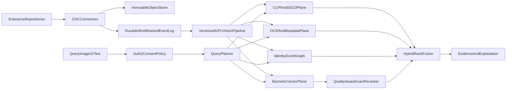

# Enterprise Face Search Platform — Architecture Review

**Classification:** Internal Architecture Review (Fortune 500)  
**Audience:** Principal Engineers, Security, Legal/Privacy, Product  
**Date:** 2026-07-17  
**Scope assumptions (confirmed):** Cloud-neutral, self-hosted / air-gappable; target **100M images**, **~1B face crops**, **p95 search < 2s**; retain **RetinaFace + ArcFace 512D**.

---

## Executive verdict

Your stack is a credible **prototype recognition core**, not yet an enterprise retrieval platform.

| Layer | Status | Severity |
|---|---|---|
| Face detection / ArcFace embeddings | Strong (InsightFace) | — |
| Vector store selection (Qdrant/Milvus) | Reasonable | Medium |
| Quality / calibration | Missing | **Critical** |
| Identity / person abstraction | Missing | **Critical** |
| Multi-stage retrieval + reranking | Missing | **Critical** |
| Incremental / deletion-safe indexing | Underspecified | **Critical** |
| Near-duplicate / event-aware aggregation | Missing | High |
| Multimodal (CLIP/OCR) + hybrid search | Missing | High |
| Enterprise connectors, ACL, biometric governance | Missing | **Critical** |
| Model/index lineage & commercial licensing | Underspecified | **Critical** |

**Bottom line:** ArcFace will not save a platform that lacks quality-aware scoring, template aggregation, hybrid retrieval, tombstone-safe incremental indexes, and repository ACL enforcement. Commercial InsightFace pretrained weights are **non-commercial by default** — MIT code ≠ commercial model rights ([InsightFace README](https://github.com/deepinsight/insightface/)).

---

## 0. Decision baseline

### 0.1 Workload & SLOs

| Metric | Target |
|---|---|
| Corpus | 100M images → ~1B faces (assume ~10 faces/image mean; plan for skew) |
| Query types | Face-by-image; person browse; temporal/metadata filters; text/OCR; hybrid |
| Latency | p95 end-to-end search < 2s; p99 < 4s |
| Freshness | New asset searchable within 5–15 min (SLA-tiered by source) |
| Deletion | Soft-suppress ≤ 60s; physical purge per policy (e.g. 24–72h + backup TTL) |
| Availability | 99.9% search plane; indexing may degrade gracefully |

### 0.2 Evaluation metrics (non-negotiable)

1. **Detection:** recall by face height (px buckets: <20, 20–40, 40–80, >80); false positive rate on non-faces.
2. **Verification:** TAR @ FAR = 1e-3 / 1e-4 / 1e-5 on enterprise holdout; **subgroup / camera / repository drift**.
3. **Clustering:** BCubed F / pairwise F; cluster purity vs. merge rate under human review.
4. **ANN:** recall@K of exact neighbors for K ∈ {100,500,2000}.
5. **End-to-end:** person-level recall@N images (not face-level only); duplicate-collapsed precision.
6. **Ops:** p95/p99 latency, index lag, backfill progress, deletion correctness after restore.

### 0.3 Threat model (abbreviated)

- Insider abuse of biometric search; exfiltration of embeddings.
- ACL bypass via unfiltered ANN (vector leak across tenants/repos).
- Model/version mix → silent accuracy collapse.
- Poison images / decompression bombs / prompt-injection via OCR into search UI.
- Restore resurrecting deleted biometrics (BIPA/GDPR erasure failure).
- Biometric regulation: notice, consent, retention, purpose limitation (BIPA, GDPR Art. 9, state privacy laws).

### 0.4 Current-design risks (critical)

1. **No FIQA / score calibration** → cosine ≠ identity probability; group photos and tiny faces destroy precision or recall depending on threshold.
2. **No person/template abstraction** → search returns faces, not people; multi-shot enrollment and cluster merge are undefined.
3. **No reranker** → ANN false neighbors surface as “matches.”
4. **No robust near-duplicate plane** → UI floods with copies; identity graphs pollute.
5. **No multimodal/metadata plane** → loses to Immich/Google Photos on non-face queries.
6. **No model/index lineage** → incompatible embeddings in one space.
7. **No deletion/security control plane** → enterprise non-starter.
8. **Celery vs Kafka ambiguity** → pick durable workflows; Celery alone is insufficient for exactly-once-ish indexing at this scale.

---

## 1. Competitor comparison (evidence-backed)

Legend: **D** = documented fact · **I** = informed inference · **—** = not a product focus

### 1.1 Capability matrix

| Capability | Your stack | Immich | PhotoPrism | DeepFace | InsightFace | Google Photos | AWS Rekognition | Azure Face |
|---|---|---|---|---|---|---|---|---|
| Face detection | RetinaFace **D** | Dedicated face detection ML job **D** | ONNX SCRFD on 720px thumbs **D** | Pluggable detectors (RetinaFace, YOLO, etc.) **D** | RetinaFace / SCRFD **D** | Face groups product feature **D**; detector proprietary **I** | DetectFaces / SearchFacesByImage **D** | Detect + landmarks/attrs **D** |
| Alignment | InsightFace `norm_crop` **D** | Internal to facial recognition pipeline **I** | Bundled with FaceNet path **I** | Optional `align=True` **D** | 5-point similarity transform **D** | Standard FR pipeline **I** | Opaque **D** | Opaque **D** |
| Embeddings | ArcFace 512D **D** | Facial recognition model (configurable preload) **D** | FaceNet 512D TF **D** | Many models incl. ArcFace **D** | ArcFace / PartialFC lineage **D** | Proprietary face + semantic embeddings **I**; Ask Photos + Gemini **D** | Proprietary collection vectors **D** | recognition_03/04 models **D** |
| Person grouping | Missing | Named people + face editor **D** | DBSCAN clusters + manual people **D** | Directory/`search` backends; not album UX **D** | Research / SDK, not album product **D** | Face Groups **D** | Users in collections (`AssociateFaces`, `SearchUsersByImage`) **D** | PersonDirectory / PersonGroups **D** |
| Quality gating | Missing | Limited (corrupt image handling) **D** | Cluster min size/score env vars **D** | Anti-spoofing optional **D** | Det score / landmarks only **D** | Quality-aware product behavior **I** | `QualityFilter` NONE/AUTO/LOW/MED/HIGH **D** | `qualityForRecognition` low/med/high **D** |
| Vector index | FAISS proto; Qdrant/Milvus planned **D** | VectorChord (pgvecto.rs removed in v3) **D** | DB similarity / distance thresholds **D** | pgvector, Weaviate, Pinecone, etc. **D** | FAISS demos in ecosystem **I** | Large-scale ANN **I** | Managed collections **D** | Managed FaceList / PersonDirectory **D** |
| Exact duplicates | Missing | Server-side duplicate resolve + EXIF merge **D** | SHA1 skip on index **D** | — | — | Dedup / storage optimization **D**/I | — | — |
| Near-dup / copies | Missing | Similarity utilities evolving **D** | Stacks / related files **D** | — | — | Strong product dedup **I** | — | — |
| CLIP / smart search | Missing | CLIP smart search + GPU accel **D** | Limited vs Immich for CLIP **I** | — | — | Classic search + Ask Photos (Gemini) **D** | Labels / custom labels / text (broader AWS CV) **D** | Face-focused; Vision for labels **D** |
| OCR | Missing | OCR present (security note in releases) **D** | Filename/sidecar heavy; OCR varies by edition **I** | — | — | Strong OCR in Ask Photos narrative **D** | DetectText / AnalyzeDocument sibling services **D** | Read/OCR via Document Intelligence **D** |
| Incremental index | Celery/Kafka TBD | Job queues for ML **D** | Background worker + faces CLI **D** | Register/search APIs **D** | Batch-oriented **D** | Continuous upload index **D** | Incremental IndexFaces **D** | Auto update PersonDirectory (no Train) **D** |
| Multi-tenant ACL | Missing | User/album sharing (consumer) **D** | Multi-user limited **D** | App-built | — | Account isolation **D** | IAM + collection scoping **D** | Azure RBAC + resource isolation **D** |
| Biometric compliance tooling | Missing | Consumer privacy settings **D** | Consumer | — | License caveats **D** | Regional Face Groups / Ask Photos limits **D** | Shared responsibility **D** | Responsible AI / limited access history **D** |
| Documented scale | Ambition: millions–1B | Self-hosted libraries **D** | Self-hosted libraries **D** | App-scale **D** | Research/SDK **D** | Billions of photos **D**/I | Collection limits apply; managed scale **D** | PersonDirectory up to tens of millions identities **D** (docs cite large figures; verify current SKU) |

**Sources (primary):**  
- Immich: [ML hardware acceleration](https://docs.immich.app/features/ml-hardware-acceleration), [v3 migration / VectorChord](https://immich.app/blog/v3-migration), [v2.7 duplicates](https://immich.app/blog/v2.7.0-release)  
- PhotoPrism: [Face recognition (dev)](https://docs.photoprism.app/developer-guide/vision/face-recognition/), [Duplicates](https://docs.photoprism.app/user-guide/library/duplicates/), [People](https://docs.photoprism.app/user-guide/organize/people/)  
- DeepFace: [serengil/deepface](https://github.com/serengil/deepface/)  
- InsightFace: [deepinsight/insightface](https://github.com/deepinsight/insightface/)  
- AWS: [SearchUsersByImage](https://docs.aws.amazon.com/rekognition/latest/APIReference/API_SearchUsersByImage.html), [thresholds](https://docs.aws.amazon.com/rekognition/latest/dg/thresholds-collections.html), [SearchFacesByImage QualityFilter](https://docs.aws.amazon.com/rekognition/latest/APIReference/API_SearchFacesByImage.html)  
- Azure: [Face recognition data structures](https://learn.microsoft.com/en-us/azure/ai-services/face/concept-face-recognition-data-structures), [Detect / qualityForRecognition](https://learn.microsoft.com/en-us/azure/ai-services/face/how-to/identity-detect-faces)  
- Google Photos: [Ask Photos](https://blog.google/products-and-platforms/products/photos/ask-photos-google-io-2024/), [Ask Photos updates](https://blog.google/products-and-platforms/products/photos/updates-ask-photos-search/) — internals are **I** only

### 1.2 What they have that you lack (exact gap inventory)

| Gap ID | Capability | Who has it | Why it hurts at 100M/1B |
|---|---|---|---|
| G1 | Face **quality filter** tied to enrollment vs search | AWS, Azure, PhotoPrism (partial) | Tiny/blurry faces dominate false accepts or force thresholds that miss true matches |
| G2 | **Person / User** object with multi-face association | AWS Users, Azure PersonDirectory, Immich/PhotoPrism People | Query image → images-of-person requires identity aggregation, not raw ANN |
| G3 | Calibrated **similarity thresholds** + response Similarity | AWS | Operators cannot set risk-based FAR without calibration |
| G4 | **CLIP / smart text** search | Immich, Google Photos | Enterprise users search “badge ceremony 2023” not only faces |
| G5 | **OCR** retrieval | Immich, Google, AWS Text APIs | Nameplates, slides, documents in photos |
| G6 | Server-side **duplicate resolution** + metadata merge | Immich, PhotoPrism (exact) | Index bloat; UX noise; skewed identity graphs |
| G7 | **DBSCAN / clustering** with human confirm | PhotoPrism, Immich | Without clustering, “find all photos of X” needs labeled gallery |
| G8 | Managed **incremental identity index** (no full retrain) | Azure PersonDirectory, AWS collections | Full rebuilds of 1B vectors are operationally lethal |
| G9 | **Anti-spoof / PAD** for enrollment | DeepFace (library), cloud vendors (partial) | Photo-of-photo enrollment in untrusted upload paths |
| G10 | Consumer-grade **explainable people UX** + merge/split | Immich, PhotoPrism, Google | Enterprise reviewers need merge/split with audit |
| G11 | **Regional biometric controls** | Google Photos | Legal cannot ship without jurisdiction switches |
| G12 | Production **vector DB ops**: sharding, tenant HNSW, snapshots | Qdrant/Milvus docs — you haven’t designed ops yet | FAISS prototype will not meet HA/deletion/DR |
| G13 | **Multimodal ask** / planner over results | Google Ask Photos | Differentiator vs open-source; optional Phase 4 |
| G14 | Commercial **model licensing** path | InsightFace commercial contacts | Legal blocker before production |

### 1.3 Critical takeaways per comparator

**Immich** — Best open-source *product* reference for CLIP + faces + GPU ML jobs + duplicates. Not enterprise ACL/multi-repo. Steal: job separation (detect vs recognize vs CLIP), VectorChord-style metadata+vector co-location patterns, duplicate resolve UX. Do **not** steal: single-library consumer tenancy.

**PhotoPrism** — Best documented open clustering knobs (DBSCAN distances, min quality/size). Steal: quality-gated clustering; faces audit/optimize CLI mindset. Do **not** steal: FaceNet-on-720px-thumb pipeline for enterprise hard-set recall (you will miss small faces).

**DeepFace** — Best *library glue* and anti-spoof hook; weak as a platform. Steal: detector/backends abstraction; optional PAD at enrollment. Do **not** run DeepFace as the production serving path.

**InsightFace** — Best recognition toolkit you already chose. Steal: RetinaFace + `norm_crop` + ArcFace ONNX serving. Fix: commercial weights; SCRFD as optional faster detector A/B; never mix model packs in one index generation.

**Google Photos** — Product north star: people + semantic + OCR + natural language + latency-tiered results (classic fast path, Gemini slow path). Internals undocumented; treat blog claims as product requirements, not algorithms.

**AWS Rekognition** — Best API design reference: Collections, Users, QualityFilter, match thresholds, UnsearchedFaces. Steal: API semantics. Cannot meet air-gap / data residency without leaving AWS.

**Azure Face** — Best identity-directory semantics (PersonDirectory, qualityForRecognition, Identify vs FindSimilar). Steal: enroll-high / identify-medium quality policy. Same cloud/air-gap constraint.

---

## 2. Module-level architecture (code contracts)

Each module below: **purpose → algorithm → paper → best OSS → reuse vs build → interface → failure modes**.

### 2.1 Face detection

| | |
|---|---|
| **Purpose** | Emit face boxes + 5 landmarks + det score; support tiny faces via multiscale / tiling |
| **Algorithm** | RetinaFace single-shot multi-level localization |
| **Paper** | Deng et al., *RetinaFace: Single-Shot Multi-Level Face Localisation in the Wild*, CVPR 2020 ([arXiv:1905.00641](https://arxiv.org/abs/1905.00641)) |
| **Best OSS** | InsightFace `detection/retinaface`; SCRFD for speed A/B ([InsightFace SCRFD](https://github.com/deepinsight/insightface/tree/master/detection/scrfd)) |
| **Decision** | **Reuse** RetinaFace weights under commercial license; **build** tiling/ROI scheduler, EXIF orientation, decode sandbox, size-bucket batching |
| **Interface** | `DetectRequest(asset_id, image_ref, model_version)` → `FaceCandidate[] {bbox, kps5, det_score, scale_used}` |
| **Failures** | Missed small faces on full-res downsample; wallpaper false positives; huge images OOM; PDF/HEIC decode variance |

**Implementation notes:** Prefer full-resolution tiled detection for faces <40px; always store `scale_used` and original bbox in asset coordinates. Separate GPU pool from embedder.

### 2.2 Alignment

| | |
|---|---|
| **Purpose** | Similarity transform to canonical 112×112 (or model native) using 5 landmarks |
| **Algorithm** | Umeyama / similarity transform (`norm_crop`) |
| **Paper** | Preprocessing convention of ArcFace pipeline; landmarks from RetinaFace |
| **Best OSS** | `insightface.utils.face_align.norm_crop` |
| **Decision** | **Reuse** exactly; do not invent custom alignment (embedding space breaks) |
| **Interface** | `Align(image, kps5, out_size)` → `aligned_rgb_uint8`, `affine_3x2`, `align_residual` |
| **Failures** | Bad landmarks → garbage embeddings; profile faces high residual — gate via quality |

### 2.3 Embedding generation

| | |
|---|---|
| **Purpose** | 512-D L2-normalized ArcFace embedding |
| **Algorithm** | ArcFace (additive angular margin) |
| **Paper** | Deng et al., *ArcFace: Additive Angular Margin Loss for Deep Face Recognition*, CVPR 2019 ([open access](https://openaccess.thecvf.com/content_CVPR_2019/html/Deng_ArcFace_Additive_Angular_Margin_Loss_for_Deep_Face_Recognition_CVPR_2019_paper.html)); Partial FC CVPR 2022 for training scale |
| **Best OSS** | InsightFace `buffalo_l` / arcface ONNX; serve via ONNX Runtime / TensorRT **after** parity tests |
| **Decision** | **Reuse** model; **build** batching, versioned artifact store, FP16 parity gates, never mix generations |
| **Interface** | `Embed(aligned_face, model_version)` → `embedding[512] float32`, `norm` |
| **Failures** | Version mix; non-aligned input; color space mismatch; TensorRT numerical drift |

### 2.4 Image / face quality scoring (FIQA)

| | |
|---|---|
| **Purpose** | Utility score for recognition; gate enrollment; weight fusion; adaptive thresholds |
| **Algorithms** | SER-FIQ (stochastic embedding robustness); CR-FIQA (relative classifiability); MagFace magnitude (if using MagFace — you keep ArcFace, so use SER-FIQ/CR-FIQA as side models); QMagFace-style **quality-aware comparison** adapted to ArcFace + external q |
| **Papers** | Terhörst et al., *SER-FIQ*, CVPR 2020 ([arXiv:2003.09373](https://arxiv.org/abs/2003.09373)); Boutros et al., *CR-FIQA*, CVPR 2023 ([arXiv:2112.06592](https://arxiv.org/abs/2112.06592)); Meng et al., *MagFace*, CVPR 2021; Terhörst et al., *QMagFace*, WACV 2023 ([arXiv:2111.13475](https://arxiv.org/abs/2111.13475)); Shi & Jain, *PFE*, ICCV 2019 (uncertainty — pre-2020 but foundational) |
| **Best OSS** | [pterhoer/FaceImageQuality](https://github.com/pterhoer/FaceImageQuality) (SER-FIQ); [fdbtrs/CR-FIQA](https://github.com/fdbtrs/CR-FIQA) |
| **Decision** | **Reuse research code as reference**; **build** production FIQA microservice + **calibrator** mapping (score, det_score, face_px, pose) → expected match reliability. Do not call MagFace a drop-in replacement for ArcFace. |
| **Interface** | `ScoreQuality(face_crop, embedding?, landmarks?)` → `{fiqa, blur, pose, face_px, occlusion, enroll_ok, search_ok}` |
| **Failures** | Domain shift (CCTV vs DSLR); treating FIQA as beauty score |

### 2.5 Clustering (identity discovery)

| | |
|---|---|
| **Purpose** | Unsupervised person hypotheses for review; seed People directory |
| **Algorithms** | Baseline: FAISS kNN graph + DBSCAN/HDBSCAN (PhotoPrism-style). Advanced: GCN clustering — Yang et al. GCN-V/E (CVPR 2020); Shen et al. *STAR-FC* (CVPR 2021); Nguyen et al. *Clusformer* (CVPR 2021); Wang et al. *Ada-NETS* (2022) |
| **Papers** | [STAR-FC arXiv:2103.13225](https://arxiv.org/abs/2103.13225); [GCN confidence/connectivity CVPR 2020](https://openaccess.thecvf.com/content_CVPR_2020/papers/Yang_Learning_to_Cluster_Faces_via_Confidence_and_Connectivity_Estimation_CVPR_2020_paper.pdf); [Ada-NETS](https://arxiv.org/abs/2202.03800) |
| **Best OSS** | PhotoPrism clustering parameters as product reference; STAR-FC code hub [sstzal.github.io/STAR-FC](https://sstzal.github.io/STAR-FC/); FAISS for kNN |
| **Decision** | **Phase 1 build** quality-gated kNN+HDBSCAN incremental clustering. **Phase 3 evaluate** STAR-FC/Ada-NETS — treat as research ports, not drop-in products. |
| **Interface** | `ClusterJob(tenant_id, face_ids[], generation)` → `ClusterHypothesis[]` + merge/split events |
| **Failures** | Twin/sibling merges; time-separated appearance splits; clustering without quality gates |

### 2.6 Vector indexing

| | |
|---|---|
| **Purpose** | Persist embeddings with payloads: tenant, ACL, asset, quality, model_version, tombstone |
| **Algorithms** | HNSW (in-RAM / on-disk); IVF-PQ / OPQ; DiskANN / Vamana |
| **Papers** | Malkov & Yashunin HNSW (2016 — foundational); Subramanya et al. *DiskANN*, NeurIPS 2019; Chen et al. *SPANN*, NeurIPS 2021 |
| **Best OSS** | **Milvus** for cloud-native billion-scale + DiskANN/GPU options ([architecture](https://milvus.io/docs/architecture_overview.md)); **Qdrant** for strong filterable HNSW + multitenancy ([multitenancy](https://qdrant.tech/documentation/manage-data/multitenancy/), [distributed](https://qdrant.tech/documentation/distributed_deployment/)); FAISS for offline build/rerank tools |
| **Decision** | **Reuse** Milvus *or* Qdrant (pick one for face plane); **build** shard router, generation aliases, payload schema, dual-write. Prefer Milvus if DiskANN/SSD-first billion vectors; Qdrant if payload-filter/tenant graphs dominate and ops prefer simpler cluster. |
| **Interface** | `UpsertFaceVector(point_id, vector, payload)`; `Search(vector, filter, k)` |
| **Failures** | Global HNSW memory blowup; filter destroying recall; mixed model_version in one collection |

### 2.7 ANN search

| | |
|---|---|
| **Purpose** | Candidate generation only — never final identity decision |
| **Algorithms** | HNSW / IVF-PQ / DiskANN with quantization (PQ, scalar, binary) |
| **Papers** | DiskANN; *FreshDiskANN* (2021) ([MSR](https://www.microsoft.com/en-us/research/publication/freshdiskann-a-fast-and-accurate-graph-based-ann-index-for-streaming-similarity-search/)); *SPFresh* (SOSP 2023) ([arXiv HTML](https://arxiv.org/html/2410.14452v1)) |
| **Best OSS** | Milvus DiskANN / HNSW; Qdrant HNSW+quantization; DiskANN reference impl for research |
| **Decision** | **Reuse** DB ANN; **build** tenant-aware routing, nprobe/ef adaptive by quality, never broadcast all shards |
| **Interface** | `AnnSearch(q, filter, k=500..5000)` → `Candidate[]` |
| **Failures** | Over-quantization; stale replicas; ignoring tombstones |

### 2.8 Reranking

| | |
|---|---|
| **Purpose** | Exact cosine on FP16/FP32 originals; quality-aware score; optional GNN / reciprocal rerank |
| **Algorithms** | Exact IP on L2-normalized vectors; quality-weighted score (QMagFace-inspired); Zhong et al.-style k-reciprocal (classic); GNN rerank Zhang et al. 2020 ([arXiv:2012.07620](https://arxiv.org/abs/2012.07620), [code](https://github.com/Xuanmeng-Zhang/gnn-re-ranking)) |
| **Best OSS** | FAISS Exact / flat IP for shortlists; GNN-rerank as optional research |
| **Decision** | **Build** mandatory exact + quality-aware rerank; **reuse** FAISS; GNN optional Phase 4 |
| **Interface** | `Rerank(query_emb, query_q, candidates) → ScoredMatch[]` with calibrated `p_match` |
| **Failures** | Skipping exact rerank; interpreting raw cosine as probability |

### 2.9 Duplicate detection

| | |
|---|---|
| **Purpose** | Exact blob dedup; near-duplicate images; duplicate face crops; **do not** collapse identities solely by ArcFace distance |
| **Algorithms** | SHA-256 exact; SSCD self-supervised copy descriptors; pHash as weak prefilter |
| **Paper** | Pizzi et al., *SSCD*, CVPR 2022 ([arXiv:2202.10261](https://arxiv.org/abs/2202.10261)); code [facebookresearch/sscd-copy-detection](https://github.com/facebookresearch/sscd-copy-detection) |
| **Best OSS** | SSCD + FAISS; Immich duplicate UX as product reference |
| **Decision** | **Reuse** SSCD weights for near-dup plane; **build** stack/merge policy and “keep master” rules |
| **Interface** | `DedupIndex(asset)` → `{exact_id, near_dup_cluster_id, sscd_vec}` |
| **Failures** | Treating edited marketing variants as same legal record incorrectly; false merges of similar events |

### 2.10 Metadata indexing

| | |
|---|---|
| **Purpose** | EXIF, path, ACL, repo, time, geo, labels, OCR text, people links |
| **Algorithms** | Relational truth in PostgreSQL; inverted/OCR search in OpenSearch; payload filters in vector DB |
| **Best OSS** | PostgreSQL/Citus; OpenSearch; Apache Tika / PaddleOCR / EasyOCR (pick one OCR stack and freeze) |
| **Decision** | **Build** canonical metadata schema; **reuse** OpenSearch for text |
| **Interface** | CDC `AssetMetadata` → search docs; ACL fields mandatory |
| **Failures** | Timezone/EXIF lies; ACL not propagated to vector payloads |

### 2.11 Incremental indexing

| | |
|---|---|
| **Purpose** | Stream inserts/updates/deletes without global rebuild |
| **Algorithms** | Mutable delta + immutable sealed segments; FreshDiskANN / SPFresh concepts; dual-write generations + alias swap |
| **Papers** | FreshDiskANN 2021; SPFresh 2023 |
| **Best OSS** | Qdrant/Milvus incremental upserts + your **generation manager**; Temporal/Kafka for orchestration |
| **Decision** | **Reuse** vector DB upserts; **build** generation/tombstone/reconcile layer (this is your IP) |
| **Interface** | `IndexMutation{upsert|delete, id, generation}`; `ReconcileManifest` |
| **Failures** | ACK before replica durable; restore without deletion journal; backfill starving live traffic |

### 2.12 Active learning / human feedback

| | |
|---|---|
| **Purpose** | Merge/split clusters; confirm matches; sample for threshold calibration; maximize recall gain per reviewer minute |
| **Algorithms** | Uncertainty sampling; open-set AL ([arXiv:2007.02196](https://arxiv.org/abs/2007.02196)); clustering + AL for re-ID ([arXiv:2112.13308](https://arxiv.org/abs/2112.13308)); ECCV 2020 unlabeled face clustering with overlap handling ([arXiv:2007.06995](https://arxiv.org/abs/2007.06995)) |
| **Best OSS** | No complete enterprise product — **build** review queue; inspiration from PhotoPrism/Immich merge UX |
| **Decision** | **Build** mandatory HITL with audit; research AL policy Phase 4 |
| **Interface** | `ReviewTask{pair|cluster, evidence, priority}`; feedback → graph edges + threshold recalibration |
| **Failures** | Feedback not versioned; reviewer bias; using feedback to silently retrain ArcFace (out of scope — you freeze ArcFace) |

### 2.13 Supporting modules (required for “Google Photos for Enterprise”)

| Module | Algorithm / stack | Paper / ref | Reuse vs build |
|---|---|---|---|
| CLIP / SigLIP semantic index | OpenCLIP / SigLIP | Radford et al. CLIP ICML 2021; SigLIP 2023 | **Reuse** OpenCLIP; separate collection from faces |
| OCR | PaddleOCR / Doc engines | — | Reuse engine; build ACL’d text index |
| Hybrid fusion | RRF then learned ranker | Cormack RRF; LTR later | Build |
| Graph | Person–Asset–Event–Repo co-occurrence | — | Build (Neo4j/FalkorDB/PG recursive) |
| Small-face assist | Optional identity-aware SR | JASRNet AAAI 2020; SPARNet TIP 2021 | Research optional; prefer better detection tiling first |
| Privacy templates | Cancelable biometrics + HE | Otroshi Shahreza et al. IJCB 2022 | Phase 5 R&D; not Day-1 |

---

## 3. Additional modules to outperform open source

Beyond ArcFace replacement (explicitly out of scope), add:

1. **Query planner** — face / text / OCR / CLIP / metadata / temporal routes with latency tiers (Google Ask Photos pattern: fast classic, slow reasoning).
2. **Quality-aware adaptive retrieval** — raise `k` and relax ANN when query FIQA low; tighten when high.
3. **Template aggregation** — quality-weighted mean / PFE-style pooling of multiple face shots into Person vector.
4. **Repository-aware ranking** — boost authoritative repos; demote bulk dumps / caches.
5. **Event / co-presence graph** — same-time, same-album, same-meeting edges for soft evidence (never sole biometric proof).
6. **Deletion-safe index generations** — tombstones + rebuild without deleted IDs + restore replay.
7. **Explainability pack** — bbox, quality, score breakdown, contributing faces, policy reasons for exclusion.
8. **Calibration service** — isotonic/Platt on held-out pairs → `p_match`; per-domain curves.
9. **Connector framework** — Google Drive → SharePoint/OneDrive/S3/Blob/Dropbox with CDC, ACL sync, incremental cursors.
10. **GPU autoscale & model residency** — separate detect/embed/CLIP pools; TensorRT with parity gates.
11. **Result caches** — query fingerprint + ACL hash; short TTL; invalidate on delete.
12. **Bias / drift monitors** — continuous TAR/FAR by repository, camera, demographics proxies (careful legal review).
13. **Legal jurisdiction profiles** — disable face search where prohibited; consent gates.
14. **Shadow index & canary queries** — model upgrades without big-bang risk.

---

## 4. Target architecture (“Google Photos for Enterprise”)

### 4.1 Logical architecture



### 4.2 Reference stack (cloud-neutral / air-gap)

| Concern | Choice |
|---|---|
| Orchestration | Kubernetes (or hardened bare metal) |
| Workflow | Temporal (or Cadence) + Kafka/Pulsar events |
| Object store | MinIO / Ceph RGW (S3 API) |
| Metadata SoT | PostgreSQL (Citus if needed) |
| Text / OCR search | OpenSearch |
| Face vectors | Milvus **or** Qdrant (single choice) |
| CLIP / SSCD vectors | Second collection / second DB namespace |
| Graph | PostgreSQL first; Neo4j if graph queries dominate |
| API | FastAPI + async workers |
| UI | React |
| Secrets | Vault / internal PKI |
| Observability | OTel + Prometheus + Grafana + Loki + Tempo |
| Identity | OIDC + SCIM; ABAC on repo/path/sensitivity |

### 4.3 Processing path

```text
Connector cursor
  → copy to object store (content-addressed) + checksum
  → emit AssetCreated (Kafka) / Temporal workflow
  → sandboxed decode + EXIF orientation
  → RetinaFace detect (+ tile if needed)
  → norm_crop align
  → ArcFace 512D L2-norm
  → FIQA + attributes
  → SSCD + CLIP + OCR (parallel)
  → upsert vectors + metadata + graph edges
  → searchable when generation replica ACK + ACL projection OK
```

**IDs:** immutable `asset_id`, `face_id`, `person_id` (person assigned post-cluster/review).  
**Version every:** detector, align, embedder, FIQA, CLIP, SSCD, preprocess, index generation.

### 4.4 Search path (p95 < 2s budget)

| Stage | Budget |
|---|---|
| AuthN/Z + consent + filter plan | 40 ms |
| Query detect + embed (+ FIQA) | 100–250 ms |
| ANN (bounded shards) | 300–700 ms |
| Exact rerank + quality score | 150–400 ms |
| Metadata / OCR / CLIP fusion | 100–250 ms |
| Serialize / network reserve | 150–300 ms |
| **Total** | **~840–1940 ms** |

Rules: warm replicas; deadline propagation; overload shedding; **no all-shard broadcast**.

### 4.5 Index topology (1B faces)

- **Do not** build one global RAM HNSW for 1B×512.
- Tenant / repo aware shards; large tenants get dedicated shards ([Qdrant tenant patterns](https://qdrant.tech/documentation/manage-data/multitenancy/)).
- Immutable PQ/IVF or DiskANN segments + **mutable delta**.
- Keep FP16 embeddings on local NVMe for exact rerank of top-M.
- Collection constraint: `model_version` + `preprocess_version` must match query.
- ACL filter **inside** ANN + post-filter before return; tombstones checked both places.

### 4.6 Sizing (order-of-magnitude)

| Data | Logical |
|---|---|
| 100M originals @ 1 MB | 100 TB |
| 1B crops @ 30 KB | 30 TB |
| ArcFace FP32 | ~2.05 TB |
| ArcFace FP16 | ~1.02 TB |
| 64-B PQ codes | ~64 GB |
| Metadata ~1 KB/face | ~1 TB |

**Physical** with EC/replication, snapshots, dual generations, 30% headroom: **~250–500 TB** start; >1 PB if originals larger / long retention.

**Ingest:** 100M / 30d ≈ 39 img/s; /7d ≈ 165 img/s. Provision 2–3×.  
**GPUs:** RetinaFace dominates. Formula: `GPUs = target_ips / measured_ips_per_gpu × margin`. Example: 8 img/s/GPU → ~30–40 GPUs for 7-day load with margin (measure on *your* corpus).

### 4.7 Security & compliance controls

- Envelope encryption; per-tenant CMKs; embedings as biometric identifiers under BIPA-style definitions.
- Consent / purpose binding on search APIs; jurisdiction kill-switches.
- Audit: who searched whom/what, with query face hash, result IDs, policy decisions.
- Deletion journal; restore must replay deletes before serving.
- DPIA; retention schedule; no sale of biometrics; vendor processor agreements for any cloud assist.
- Model supply chain: signed artifacts, SBOM, license attestation for InsightFace weights.

### 4.8 Hard bottlenecks (design against these)

1. RetinaFace on multi-scale huge images  
2. Global search fanout  
3. Exact rerank random I/O  
4. Selective filters killing ANN recall  
5. 1B tiny crop objects in object store (pack crops into shard files)  
6. Index rebuild during mass delete / model migrate  
7. Backfill vs live ingest contention  
8. Mixed embedding versions  
9. Stale cache showing deleted faces  
10. Poison / zip-bomb images  

---

## 5. Research papers (2020+) to improve *this* architecture

Prioritized by production impact while **keeping ArcFace**.

### Tier A — implement / adapt soon

| Paper | Venue | Why |
|---|---|---|
| SER-FIQ | CVPR 2020 | Unsupervised FIQA on ArcFace |
| CR-FIQA | CVPR 2023 | Strong FIQA |
| QMagFace | WACV 2023 | Quality-aware comparison pattern |
| SSCD | CVPR 2022 | Near-duplicate plane |
| FreshDiskANN | 2021 | Streaming ANN freshness |
| SPFresh | SOSP 2023 | Low-cost incremental billion-scale updates |
| STAR-FC | CVPR 2021 | Large-scale face clustering baseline |
| CLIP | ICML 2021 | Semantic search plane |
| SigLIP | 2023 | Stronger open CLIP-class encoders via OpenCLIP |

### Tier B — differentiation

| Paper | Venue | Why |
|---|---|---|
| GCN-V/E clustering | CVPR 2020 | Learnable cluster graphs |
| Ada-NETS | 2022 | Cleaner kNN graphs |
| GNN re-ranking | 2020/TOMM | Real-time rerank |
| Improving FR by clustering unlabeled faces | ECCV 2020 | Open-set overlap / pseudo-label noise |
| Hybrid CB + HE templates | IJCB 2022 | Privacy-preserving matching R&D |
| JASRNet / SPARNet | AAAI 2020 / TIP 2021 | Tiny-face SR *after* tiling still fails |
| ColPali | 2024 | Document-page retrieval if enterprise scans dominate |

### Tier C — product intelligence

| Paper / product pattern | Why |
|---|---|
| Deep AL via open-set recognition (2020) | Review sampling |
| Unsupervised clustering AL for re-ID (2021) | HITL efficiency |
| Google Ask Photos (product, 2024–2025) | Latency-tiered multimodal UX requirements |

---

## 6. Patents / publishable opportunities (preliminary, not legal advice)

**Crowded (high prior-art risk):** plain face search; ArcFace; HNSW/FAISS usage; basic CLIP photo search; simple DBSCAN people albums; vanilla quality thresholds.

**More defensible combinations (technical screening only):**

| Idea | Novelty angle | Prior-art tension | Publish vs patent |
|---|---|---|---|
| **Calibrated quality-aware multi-index retrieval** | Joint policy over FIQA + ANN `k` + exact rerank + ACL selectivity | QMagFace, AWS QualityFilter, search textbooks | Strong **paper**; patent only if concrete adaptive controller + telemetry claims |
| **Deletion-safe incremental biometric index generations** with restore-time tombstone replay | Enterprise erasure correctness as system claim | FreshDiskANN/SPFresh (freshness), GDPR engineering | **Systems paper** + possible patent on restore/deletion journal interplay |
| **Repository-ACL-aware ANN routing** with proof that unauthorized vectors never enter candidate set | Security architecture | Multitenant Qdrant patterns | Patent/trade secret hybrid |
| **Event co-presence graph as soft rerank feature** with calibrated fusion (not hard identity) | Graph+biometric fusion with abstention | Social graph FR papers (crowded) — narrow to enterprise repo/event ontology | Paper if ablations strong |
| **Expected-recall-gain active review** for cluster merge/split | AL objective tied to retrieval metric | Active learning FR / re-ID | Good **paper** |
| **Dual-plane SSCD + ArcFace demotion** of copy floods in person results | Product+method | SSCD, Immich dedup | Modest novelty; still useful trade secret |
| **Air-gapped multi-connector CDC with biometric minimization** (store templates, short-lived crops) | Compliance architecture | Standard DLP/biometric guidance | Patent claims thinner; policy differentiator |

File patents only after formal prior-art search by counsel. Prefer publishable benchmarks (enterprise-like long-tail faces, ACL constraints, deletion SLOs) — those datasets/protocols themselves are publishable contributions.

---

## 7. Redesigned product architecture summary

### 7.1 Planes of retrieval

1. **Biometric plane** — RetinaFace → align → ArcFace → FIQA → ANN → exact quality-aware rerank → person aggregate  
2. **Media plane** — CLIP/SigLIP + SSCD  
3. **Text plane** — OCR + EXIF + path + enterprise metadata  
4. **Graph plane** — people, events, repos, co-occurrence  
5. **Policy plane** — consent, ACL, jurisdiction, purpose  

Open-source Immich/PhotoPrism essentially give you (1 partial)+(2)+(weak 3). Cloud face APIs give strong (1 identity APIs) without your data plane. **Winning requires all five under air-gap.**

### 7.2 Phased delivery (acceptance-gated)

**Phase 0 — Legal/License (blocker)**  
Commercial InsightFace weights; DPIA; retention; consent UX.

**Phase 1 — Correctness foundation**  
Connectors (Drive first), object store, Temporal/Kafka, detect/align/embed versioned, PostgreSQL schema, FIQA, exact+ANN search with ACL filters, soft delete/tombstones, audit.  
*Gate:* TAR/FAR on holdout; ACL red-team; deletion test incl. restore.

**Phase 2 — Scale**  
Sharded vector DB, delta+sealed segments, GPU pools, crop packing, p95 < 2s at 10% scale then 100%.  
*Gate:* ANN recall@K; soak test; chaos on shard loss.

**Phase 3 — People & dedup**  
Clustering, person objects, Immich-like merge/split, SSCD stacks.  
*Gate:* cluster F-score; reviewer throughput.

**Phase 4 — Multimodal**  
CLIP/OCR hybrid, query planner, explainability UI.  
*Gate:* text query nDCG; face+text hybrid uplift.

**Phase 5 — Intelligence & privacy R&D**  
Learned ranker, active learning, optional SR, CB+HE templates.  
*Gate:* measured lift vs Phase 4; latency regression budget.

### 7.3 What to refuse in design reviews

- Single global FAISS file as “production.”  
- Cosine threshold without calibration.  
- Indexing without `model_version`.  
- Returning ANN hits without exact rerank.  
- Face search without ACL projection.  
- Crop-per-object for 1B faces in S3.  
- Silent TensorRT without parity suite.  
- Clustering that auto-publishes identities without review in high-risk tenants.

---

## 8. Direct answers checklist (mapping to original questions)

1. **Comparison** — §1 matrix.  
2. **Missing capabilities** — §1.2 gap table G1–G14.  
3. **Module-level explanation** — §2.  
4. **Best OSS / algorithm / paper / reuse** — each §2 subsection.  
5. **Extra modules to win** — §3.  
6. **Papers 2020+** — §5.  
7. **Patents / research opportunities** — §6.  
8. **Redesign** — §4 and §7.

---

## Appendix A — Suggested repository layout (when implementation starts)

```text
services/
  connector-*/          # Drive, SharePoint, ...
  ingest-api/
  vision-worker/        # detect, align, embed, fiqa
  media-worker/         # clip, sscd, ocr
  search-api/           # planner, ann, rerank, fusion
  identity-service/     # persons, clusters, review
  policy-service/       # ACL, consent, jurisdiction
  index-controller/     # generations, tombstones, reconcile
packages/
  schemas/              # protobuf/jsonschema IDs & events
  eval/                 # TAR/FAR, ACL tests, latency harness
deploy/
  helm/                 # milvus|qdrant, postgres, opensearch, temporal
```

## Appendix B — Minimal score fusion (illustrative)

```text
s_face = quality_aware_cosine(q_emb, g_emb, q_fiqa, g_fiqa)
s_clip = cosine(q_clip, g_clip)          # if text/image semantic query
s_ocr  = bm25(q_text, ocr_doc)
s_graph = log(1 + copresence_evidence)

# Phase 1–3: RRF
score = Σ 1/(k + rank_i)

# Phase 5: learned LambdaMART/XGBoost on features above + repo prior
# Always multiply by acl_allowed ∈ {0,1} and not_tombstoned ∈ {0,1}
```

## Appendix C — Key references (URLs)

- InsightFace: https://github.com/deepinsight/insightface/  
- RetinaFace: https://arxiv.org/abs/1905.00641  
- ArcFace: https://openaccess.thecvf.com/content_CVPR_2019/html/Deng_ArcFace_Additive_Angular_Margin_Loss_for_Deep_Face_Recognition_CVPR_2019_paper.html  
- PhotoPrism faces: https://docs.photoprism.app/developer-guide/vision/face-recognition/  
- Immich ML / VectorChord: https://docs.immich.app/features/ml-hardware-acceleration · https://immich.app/blog/v3-migration  
- DeepFace: https://github.com/serengil/deepface/  
- AWS SearchUsersByImage: https://docs.aws.amazon.com/rekognition/latest/APIReference/API_SearchUsersByImage.html  
- Azure PersonDirectory: https://learn.microsoft.com/en-us/azure/ai-services/face/concept-face-recognition-data-structures  
- SER-FIQ: https://arxiv.org/abs/2003.09373  
- CR-FIQA: https://arxiv.org/abs/2112.06592  
- SSCD: https://arxiv.org/abs/2202.10261  
- FreshDiskANN: https://www.microsoft.com/en-us/research/publication/freshdiskann-a-fast-and-accurate-graph-based-ann-index-for-streaming-similarity-search/  
- SPFresh: https://arxiv.org/html/2410.14452v1  
- STAR-FC: https://arxiv.org/abs/2103.13225  
- Qdrant multitenancy: https://qdrant.tech/documentation/manage-data/multitenancy/  
- Milvus architecture: https://milvus.io/docs/architecture_overview.md  
- Google Ask Photos: https://blog.google/products-and-platforms/products/photos/ask-photos-google-io-2024/  

---

*End of architecture review.*
